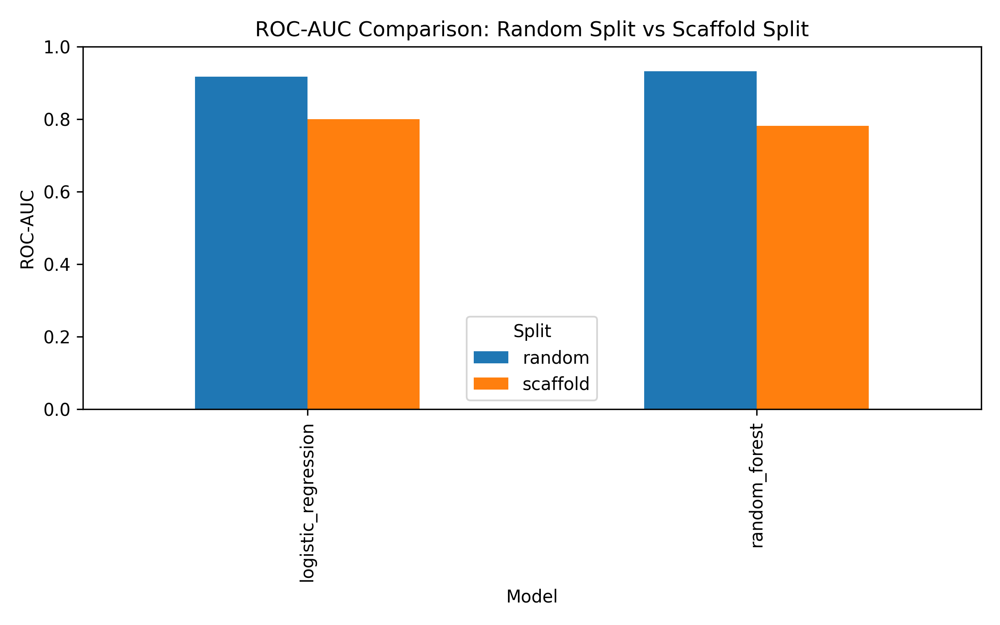
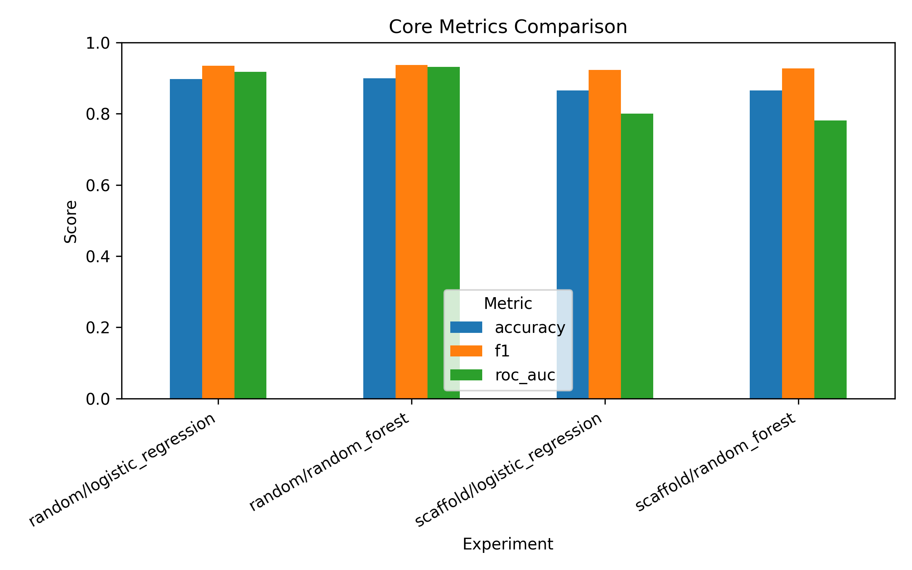

# Molecular Generalization Benchmark

A reproducible benchmark for evaluating whether **random split overestimates molecular property prediction performance** compared with **scaffold split**.

---

## Key Finding

Models perform clearly better under **random split** than under **scaffold split**, especially in **ROC-AUC**. This suggests that random splitting may give an overly optimistic estimate of molecular generalization performance, while scaffold splitting provides a stricter test of structural generalization.

---

## Main Results

| Split | Model | Accuracy | F1 | ROC-AUC |
|---|---|---:|---:|---:|
| Random | Logistic Regression | 0.8971 | 0.9352 | 0.9173 |
| Random | Random Forest | 0.8995 | 0.9374 | 0.9321 |
| Scaffold | Logistic Regression | 0.8655 | 0.9235 | 0.8003 |
| Scaffold | Random Forest | 0.8655 | 0.9275 | 0.7817 |

---

## Result Figures

### ROC-AUC Comparison


### Core Metrics Comparison


---

## Project Overview

This project investigates **molecular generalization** in a binary molecular property prediction task. The central question is whether **random train-test splitting** leads to overly optimistic performance estimates compared with **scaffold-based splitting**, where test molecules are structurally more distinct from training molecules.

In the first stage, this benchmark uses:

- **Dataset**: BBBP
- **Representation**: Morgan fingerprints
- **Models**: Logistic Regression, Random Forest
- **Splits**: Random Split, Scaffold Split

The workflow covers SMILES cleaning, molecular featurization, data splitting, baseline model training, metric evaluation, and result visualization.

---

## Research Question

**Does random split overestimate model performance in molecular property prediction because structurally similar molecules may appear in both the training and test sets?**

To examine this question, the project compares model performance under two data splitting strategies:

- **Random Split**: molecules are randomly divided into training and test sets.
- **Scaffold Split**: molecules are grouped by their **Bemis–Murcko scaffolds**, making the test set structurally more distinct from the training set.

If performance is substantially higher under random split than under scaffold split, this suggests that random split may overestimate the model’s ability to generalize to new regions of chemical space.

---

## Dataset

This project uses the **BBBP** dataset, a binary classification dataset for predicting **blood-brain barrier permeability**. Each molecule is represented by a SMILES string and a binary label.

After SMILES validity checking and canonicalization with **RDKit**, the cleaned dataset contains **2,039 molecules**.

---

## Methodology

### 1. SMILES Preprocessing
Input SMILES strings are validated with **RDKit**. Invalid SMILES and empty strings are removed, and valid molecules are converted into **canonical SMILES** for consistent downstream processing.

### 2. Molecular Featurization
Molecules are represented using **Morgan fingerprints** with the following configuration:

- **Radius**: 2
- **Bit vector length**: 2048

### 3. Data Splitting Strategies
Two splitting strategies are implemented:

- **Random Split**: may place structurally similar molecules in both training and test sets.
- **Scaffold Split**: keeps molecules with the same scaffold in the same split, producing a more structurally distinct test set.

### 4. Baseline Models
Two classical machine learning baselines are used:

- **Logistic Regression**
- **Random Forest**

### 5. Evaluation Metrics
Performance is evaluated using:

- **Accuracy**
- **Precision**
- **Recall**
- **F1-score**
- **ROC-AUC**

---

## Repository Structure

```text
mol-generalization-benchmark/
│
├── README.md
├── requirements.txt
├── run_experiment.py
│
├── data/
│   ├── raw/
│   └── processed/
│
├── src/
│   ├── data/
│   ├── featurizers/
│   ├── splits/
│   ├── models/
│   ├── evaluation/
│   └── visualization/
│
├── results/
│   ├── tables/
│   └── figures/
│
└── report/
```
## How to Run

### 1. Create and activate a virtual environment

Create a virtual environment:

```bash
python -m venv .venv
```

Activate it on **Windows**:

```bash
.venv\Scripts\activate
```

Activate it on **macOS/Linux**:

```bash
source .venv/bin/activate
```

### 2. Install dependencies

```bash
pip install -r requirements.txt
```

### 3. Run one experiment

The `run_experiment.py` script supports **one split strategy** and **one model** at a time.

Example: **random split + Logistic Regression**

```bash
python run_experiment.py --split random --model logistic_regression
```

Example: **scaffold split + Random Forest**

```bash
python run_experiment.py --split scaffold --model random_forest
```

### Supported split options

- `random`
- `scaffold`

### Supported model options

- `logistic_regression`
- `random_forest`

### 4. Generate the metrics summary

```bash
python src/evaluation/metrics.py
```

This saves the summary table to:

```text
results/tables/bbbp_metrics_summary.csv
```

### 5. Generate result figures

```bash
python src/visualization/plot_results.py
```

This saves figures to:

```text
results/figures/
```

---

## Current Scope and Limitations

### Current scope

This project currently includes:

- **one dataset**: BBBP
- **one molecular representation**: Morgan fingerprint
- **two baseline models**: Logistic Regression and Random Forest
- **two split strategies**: Random Split and Scaffold Split

### Current limitations

This project does **not yet** include:

- graph neural network baselines
- similarity-based split
- cluster-based split
- multi-dataset benchmark experiments
- detailed error analysis

---

## Future Work

Possible future extensions include:

- adding **similarity split** and **cluster split**
- evaluating **graph neural network** baselines
- extending the benchmark to more molecular datasets
- performing deeper error analysis on false positives and false negatives

---

## Summary

This project builds a reproducible benchmark pipeline for evaluating molecular generalization under different data splitting strategies.

The first-stage results suggest that **random split may overestimate model performance**, while **scaffold split provides a stricter and more realistic test of structural generalization** in molecular property prediction.
